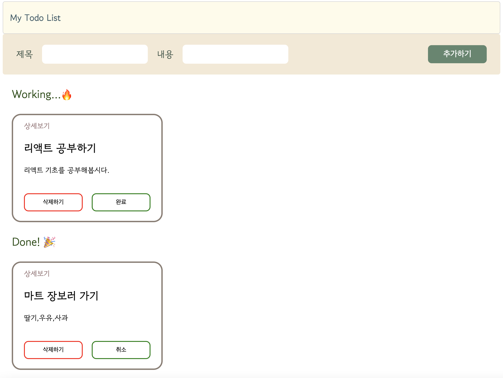
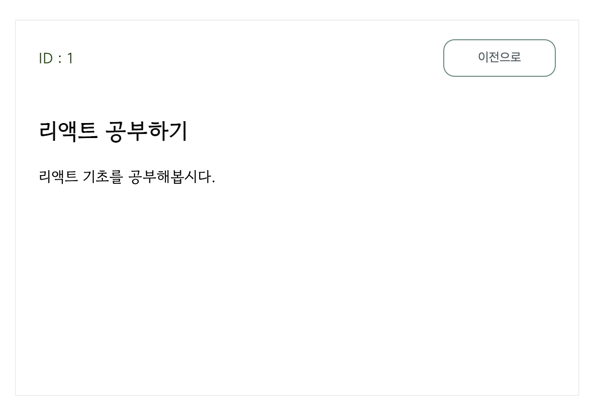
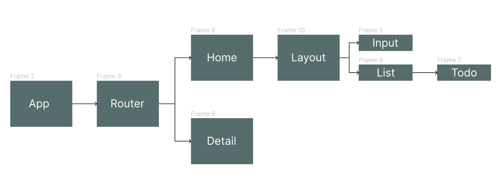

# 프로젝트 To Do List - 2탄 🧭

React - Redux로 To Do List 만들기 😉
 
 

 
 

 
 

# 요구 사항

1. todos 데이터는 리덕스를 사용해서 전역으로 상태를 관리합니다. 
todos 모듈은 `Ducks 패턴`으로 구현합니다.
2. input에 값이 있는 상태에서 상세페이지로 이동하는 경우, input의 value가 초기화 되도록 구현합니다.
3. **상세보기**를 클릭하면 Todo의 상세 페이지로 이동합니다.
(보여야 하는 내용: 현재 Todo의 ID 값, 제목, 내용, '이전으로' 버튼)

 
 

# 구현한 기능

- UI 디자인
- Todo 추가 하기
- Todo 삭제 하기
- Todo 완료 상태 변경하기 (완료 ↔ 진행중)
- 메인 페이지 
- 상세 페이지 (현재 Todo의 ID, 제목, 내용, 메인 페이지로 이동)

 
 

# 사용한 Hook
## React Hook
- **useState**
 
- **useEffect**
 

## Redux Hook
 - **useDispatch**
  
 - **useSelector**

## React Router DOM
 - **useNavigate**
  
 - **useParams**

 
 

# 컴포넌트 구조

- App : 최상위 컴포넌트. Router컴포넌트를 return 한다.

- Router : react-router-dom 패키지를 사용해서 Home과 Detail 페이지를 구현했다. Dynamic Route로 path에 유동적인 값을 넣어서 특정 페이지(현재 Todo의 ID 값으로 이동)

- Detail : '상세보기'를 누르면 이동하는 상세 페이지.

- Home : 메인 페이지. Layout컴포넌트 안에 Input과 List컴포넌트를 넣어서 return 한다.

- Layout : 기본 골격 구조를 위해 만든 컴포넌트. Header컴포넌트와 Home컴포넌트에서 넘어온 자식(Input, List)을 품고있다.

- Input : input에서 입력받은 값을 dispatch로 reducer에 전달한다.

- List : Todo List가 나오는 전체 구역으로 useSelector로 Store에서 데이터를 받아와서 렌더링하고있다. props로 Todo컴포넌트에게 데이터를 전달한다.

- Todo : Todo의 내용과 버튼이 나오는 상자를 만드는 컴포넌트.

